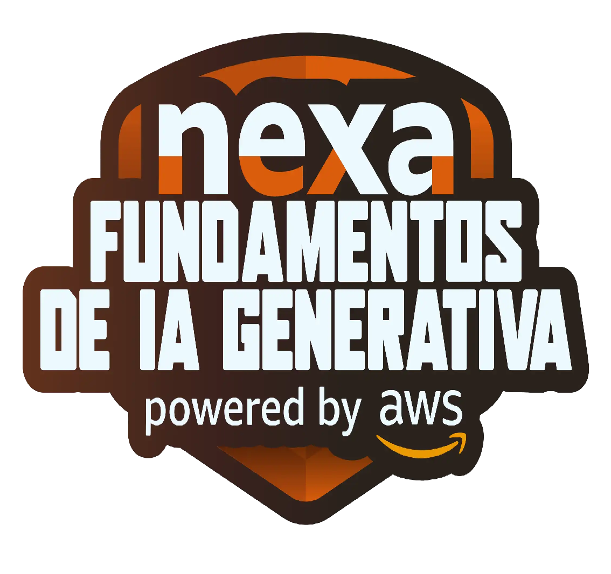
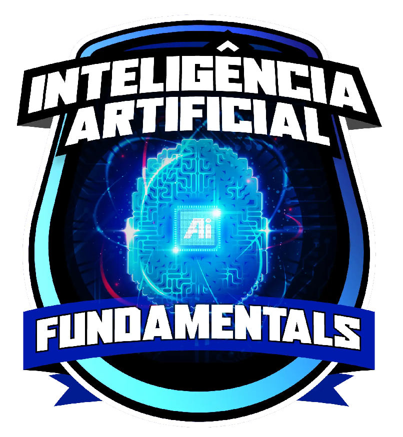

# A INVASÃO 

## A Misteriosa trama cheia de suspense e aventura
 
## 📒 Descrição
Esse projeto foi incentivado pela [DIO](www.dio.me) em dois de seus brilhantes bootcamps: **Bootcamp Nexa - Fundamentos de IA Generativa e Claude 3** & **Formação Fundamentos de Inteligência Artificial**.

    

Esse projeto perpassa pelas principais tecnologias de IA do mercado com objetivo de demonstrar um pouco mais sobre a capacidade destas tecnologias em produzir conteúdos que outrora eram privativos a humanos. Seja na criação de uma canção, na narração, idealização e criação de uma história, ou no design de uma imagem e pintura.

Tanto é verdade que até mesmo nesta documentação certos trechos podem ou não terem sido criados por IA, certas idealizações podem ou não terem sido criadas por IA e por ae vai. Caberá ao bom leitor julgar.

Em algumas palavras, essa história é de uma jovem, chamada Ana, que sozinha em sua casa percebe que seu planeta está sendo invadido. Com muita coragem adota uma postura ativa para se salvar.

## 🤖 Tecnologias Utilizadas
<ul>
   <li><strong>ChatGPT</strong>
     

      Em suma trata-se de um modelo de linguagem avançado desenvolvido pela OpenAI para gerar texto baseado em entradas de usuários.
      Neste projeto foi utilizado de duas formas, a primeira é com a criação do enrendo e texto utilizado para narração, a segunda é com a criação de 5 prompts para geração das imagens.
     

   </li>
   <li><strong>Gemini</strong>
     

      Em suma trata-se de um sistema de IA desenvolvido pelo Google para processamento de linguagem natural e compreensão de texto.
      Utilizado para criação de prompts personalizados para o Suno, por meio de instruções do enredo e das perspectivas que tinha sobre as trilhas sonoras.
     

   </li>
   <li><strong>Suno</strong>
     

      Em suma trata-se de uma plataforma que usa IA para geração de conteúdo de áudio, como narrações e conversas realistas.
      Suno é brilhante naquilo que se propõe, com os prompts personalizado, foi utilizado na criação da trilha sonora e música temática.
     

   </li>
   <li><strong>ElevenLabs</strong>
     

      Em suma trata-se de uma tecnologia de IA focada na geração de vozes sintéticas realistas e personalizadas para diversas aplicações.
      Após receber o enrendo do ChatGPT o ElevenLabs foi utilizado para criar a narração.
     

   </li>
   <li><strong>Leonardo AI</strong>
     
 
      Em suma trata-se de uma ferramenta de IA que cria arte digital e ilustrações a partir de descrições textuais.
      O Leonardo AI foi um criado subsidiário de imagens, foi utilizado como teste de prompt e foi utilizado uma imagem dentre todas as solicitadas.
     

   </li>
   <li><strong>Copilot</strong>
     

      Em suma trata-se de um assistente de codificação baseado em IA desenvolvido pela GitHub e OpenAI para ajudar programadores a escreverem código dentre outras funcionalidades como geração de imgens e textos.
      Os prompts do ChatGPT se adequaram melhor ao Copilot, principal responsável pelas imagens do projeto.
     

   </li>
  <li><strong>CapCut</strong>
     
Utilizado para edição do vídeo

</ul>

## 🧐 Processo de Criação
Descreva como você criou o conteúdo

## 🚀 Resultados

Antes de mais nada sintam-se convidados a assistir esse teaser do projeto:

<video width="320" height="240" controls>
  <source src="vassets/video-audio/Projeto_IA_Teaser.mp4" type="video/mp4" alt="video teaser">
</video>

## 💭 Reflexão
Comente sobre o desafio de criar algo 'natty' com IA.

## Links Interessantes
